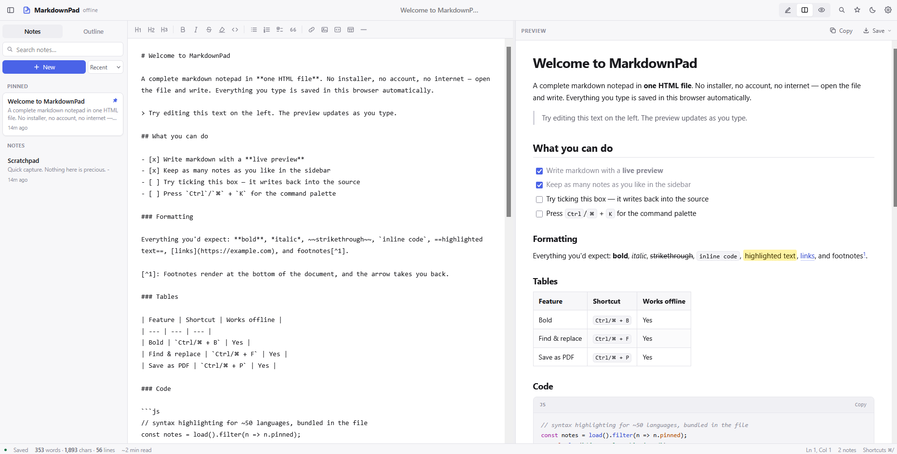
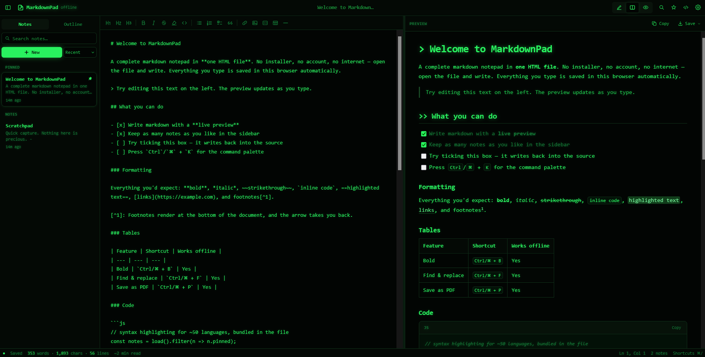
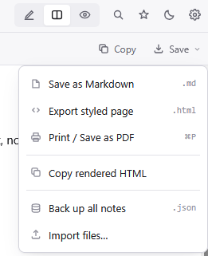

# MarkdownPad

A complete markdown notepad in **one HTML file**. No installer, no build step, no account, no server, no network calls — download `markdownpad.html`, open it in a browser, and start writing.

## What it is

MarkdownPad is a single self-contained HTML file (~400 KB) that bundles a markdown editor, a live preview, and a small notes app together with everything they need to run: [Marked](https://github.com/markedjs/marked) for parsing, [DOMPurify](https://github.com/cure53/DOMPurify) for sanitizing the rendered output, and [highlight.js](https://github.com/highlightjs/highlight.js) for code syntax highlighting — all vendored inline. There is no external request anywhere in the file; everything it needs ships with it.

Your notes are stored in the browser's own `localStorage`, scoped to wherever you open the file from. Nothing is ever sent anywhere.

## Screenshots

|  |  |
|---|---|
|  |  |
| Light theme | Hacker theme |

Export menu

## Getting started

1. Download `markdownpad.html`.
2. Open it in any modern browser (double-click it, or `File → Open`).
3. Start typing in the left pane — the right pane renders it live.

That's it. No `npm install`, no dev server, no account to create.

## Features

**Editor & preview**
- Live split-pane markdown preview (editor-only, split, or preview-only views)
- GitHub-flavored markdown: tables, task lists, footnotes, `==highlighted text==`
- Syntax-highlighted fenced code blocks (~50 languages) with a one-click copy button
- YAML front matter rendered as a small key/value card
- Auto-generated heading anchors and a clickable document outline in the sidebar
- Synchronized scrolling between editor and preview

**Notes**
- Multiple notes with pin, search, and sort (recent / created / title)
- Auto-derived titles and tags (`#tag` anywhere in a note tags it)
- Drag-and-drop `.md` file import, or paste/drop images directly into a note (auto-compressed and embedded as data URIs)

**Editing conveniences**
- Formatting toolbar (bold, italic, strikethrough, highlight, headings, lists, task lists, blockquote, links, images, code blocks, tables, horizontal rules)
- Smart list continuation, auto-closing brackets/quotes, indent/outdent, move/duplicate/delete line
- Find & replace with match case, whole word, and regex support
- A command palette (`Ctrl/⌘+K`) for every action and every note
- Full keyboard shortcut reference (`Ctrl/⌘+/`)

**Export**
- Save the current note as `.md`
- Export a styled, self-contained `.html` page
- Print / Save as PDF (uses the browser's own print dialog)
- Copy rendered HTML to the clipboard
- Back up all notes to a single `.json` file, and restore from one later

**Appearance**
- Light, Dark, and a "Hacker" (green-on-black, CRT-scanline) theme, plus a system-follow option
- Adjustable editor font (mono/sans/serif), font size, and preview line width
- Focus mode and typewriter scrolling
- Fully responsive down to mobile widths

**Privacy**
- Zero network requests — verified by reading the file; there is no `fetch`, `XMLHttpRequest`, or remote asset anywhere in it
- All data lives in the browser's local storage on the device you're using
- Nothing to configure, no telemetry, no analytics

## Why a single file

No build pipeline, no dependency versions to keep in sync, no server to host. Copy `markdownpad.html` to a USB drive, an air-gapped machine, or just keep it in a folder — it works exactly the same everywhere a browser can open a local file.

## Browser support

Any current version of Chrome, Firefox, Safari, or Edge. The file uses modern CSS (`color-mix()`, `dvh` units) and JS (`localStorage`, the Clipboard API) that are broadly supported in browsers from the last few years.

## License

No license file has been added yet — treat this as "all rights reserved" until one is added, or open an issue/PR if you'd like a specific license applied.
